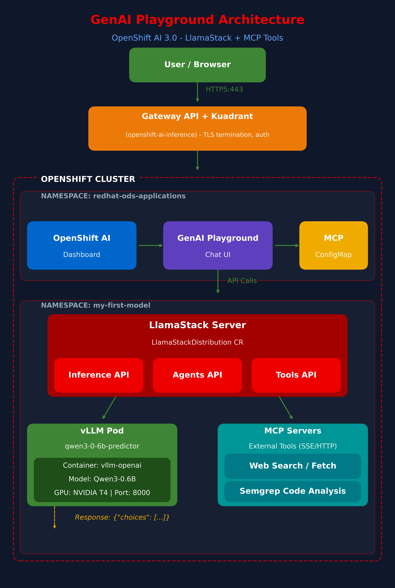

# OpenShift AI 3.0 Blog Series

A complete guide to deploying and managing Large Language Models on OpenShift AI 3.0.

---

## Blog Series

### [Blog 1: LLM Deployment with LLM-D](BLOG.md)
*From Container to Production: Deploying LLMs on OpenShift AI 3.0 with Intelligent Load Balancing*

Learn how to:
- Set up Gateway API for secure HTTPS access
- Enable Kuadrant authentication
- Deploy models using LLMInferenceService
- Handle Tesla T4 GPU compatibility issues

---

### [Blog 2: GenAI Playground + MCP](BLOG-2-GENAI-PLAYGROUND-MCP.md)
*Building an AI Chat Interface with GenAI Playground and MCP Tools*

Learn how to:
- Enable GenAI Playground (LlamaStack)
- Connect the chat UI to your deployed models
- Add MCP servers for external tools (web search, code analysis)
- Build agents with multi-turn conversations

---

## Quick Links

- **GitHub Repository:** [github.com/nirjhar17/openshift-ai-3-deployment](https://github.com/nirjhar17/openshift-ai-3-deployment)
- **OpenShift AI 3.0 Docs:** [docs.redhat.com](https://docs.redhat.com/en/documentation/red_hat_openshift_ai_self-managed/3.0)
- **Kuadrant Docs:** [kuadrant.io](https://kuadrant.io/)

---

## Architecture Diagram

---

*Author: Nirjhar Jajodia | January 2026*

